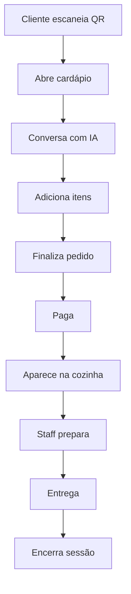

# 🍽️ MetrIA - Sistema de Cardápio Digital com IA

[](https://metria-production.up.railway.app)
[](https://firebase.google.com)
[](https://deepseek.com)

Sistema completo de cardápio digital com QR Code individual por mesa, assistente de IA integrado, pagamentos e painéis de gerenciamento.

## 🚀 Funcionalidades

### 📱 Para o Cliente
- **QR Code único por mesa** com sessão individual
- **Cardápio digital interativo** com categorias
- **Assistente IA** para recomendações personalizadas
- **Carrinho inteligente** ("prato") com contador
- **Chamada de garçom** com um clique
- **Pedidos extras** durante a refeição

### 👨‍🍳 Painel da Cozinha
- **Pedidos em tempo real** com status
- **Alertas de garçom** visuais e sonoros
- **Controle de etapas** (Pendente → Entregue)
- **Pedidos extras** identificados

### 🔧 Painel Administrativo
- **Geração automática de mesas** com QR Codes
- **Download de QR Codes** individuais
- **Controle de sessões** (abrir/fechar mesas)
- **Histórico completo de pedidos**
- **Configuração do assistente IA**

## 🤖 Assistente IA (DeepSeek)

- **Contextual**: Conhece todo o cardápio em tempo real
- **Personalizado**: Recomendações baseadas no perfil
- **Inteligente**: Explica ingredientes e preparos
- **Integrado**: Orienta sobre como fazer pedidos
- **Sessões**: Mantém histórico por mesa

## 🛠️ Stack Tecnológica

- **Frontend**: React + Vite + TypeScript + Tailwind CSS
- **Backend**: Node.js + Express + TypeScript
- **Database**: Firebase Firestore
- **AI**: DeepSeek API
- **Deploy**: Railway (Backend) + Hostinger (Frontend)
- **Pagamentos**: iPag (em desenvolvimento)

## 🌐 URLs do Sistema

- **API**: https://metria-production.up.railway.app
- **Cardápio**: `/m/{restaurantId}/{tableId}?t={token}`
- **Cozinha**: `/kitchen`
- **Admin**: `/admin`

## 📋 Instalação

### 1. Clone o repositório
```bash
git clone https://github.com/NagaSistemas/MetrIA.git
cd MetrIA
```

### 2. Backend
```bash
cd backend
npm install
cp .env.example .env
# Configure as variáveis de ambiente
npm run dev
```

### 3. Frontend
```bash
cd frontend
npm install
cp .env.example .env
# Configure as variáveis de ambiente
npm run dev
```

### 4. Popular dados iniciais
```bash
cd backend
npm run seed
```

## 🔧 Configuração

### Firebase
1. Crie um projeto no Firebase
2. Baixe o arquivo de credenciais JSON
3. Configure as variáveis de ambiente

### DeepSeek AI
1. Obtenha uma API key do DeepSeek
2. Configure no arquivo `.env`

### Railway (Deploy)
1. Conecte o repositório ao Railway
2. Configure as variáveis de ambiente
3. Deploy automático

## 📊 Fluxo de Uso



## 🎯 Estados da Mesa

- **OPEN**: Disponível para pedidos
- **ORDERING**: Cliente montando pedido  
- **PAYING**: Processando pagamento
- **PAID**: Pagamento confirmado
- **CLOSED**: Sessão encerrada

## 📁 Estrutura do Projeto

```
MetrIA/
├── frontend/          # React App
├── backend/           # Node.js API
├── shared/            # Tipos TypeScript
├── Agente/            # Sistema IA original
└── docs/              # Documentação
```

## 🔄 Próximos Passos

- [ ] Integração completa iPag
- [ ] Notificações push
- [ ] App mobile nativo
- [ ] Relatórios e analytics
- [ ] Sistema de avaliações

## 📄 Licença

MIT License - veja [LICENSE](LICENSE) para detalhes.

---

**Desenvolvido por [Naga Sistemas](https://github.com/NagaSistemas)**